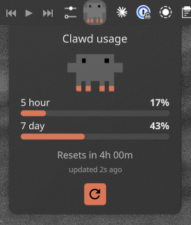
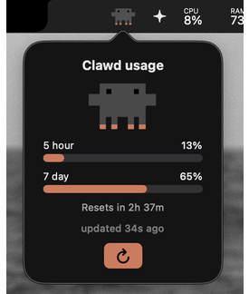

# Clawd Usage

Cross-platform desktop widget that shows Claude Code rate limit usage, built with Python and native UI per platform (SwiftUI on macOS, QML on KDE Plasma 6).
A stdlib-only Python daemon refreshes the OAuth token, polls the Anthropic usage API, and writes a shared state file; each platform's native widget reads that file and renders Claw'd, whose silhouette fills bottom-up with usage.

 

Requires Claude Code logged in (`claude auth login`).

## Components

- **daemon** (`main.py` + `src/`): entry point to the system. Refreshes the OAuth access token via keychain (macOS) or credentials file (Linux), polls `api.anthropic.com/api/oauth/usage` every 60s, and writes `~/.claude/usage-bar-state.json`. On auth failure writes `auth_error` instead of going silently stale. Listens for `SIGUSR1` to poll immediately on demand.
- **linux/plasmoid**: KDE Plasma 6 widget (QML), installed via `kpackagetool6`, run as a systemd user service.
- **macos**: SwiftUI menu bar app, installed to `~/Applications`, daemon vendored to `~/Library/Application Support/ClawdUsage` and run via launchd so it survives the repo being moved or deleted.

All UI reads happen via the shared state file. No direct daemon-to-widget communication.

## State File

`~/.claude/usage-bar-state.json`, written atomically on every successful poll:

- `used_percentage` / `resets_at`: 5-hour window
- `seven_day_percentage` / `seven_day_resets_at`: 7-day window
- `updated_at`: ISO timestamp of last successful poll
- `auth_error`: set instead of the above when the refresh token is missing or invalid

## Running the Project

### Stack

- Python 3.10+ (stdlib only, no third-party deps)
- SwiftUI + AppKit (macOS 13+, Xcode Command Line Tools)
- QML (KDE Plasma 6, `kpackagetool6`, `systemctl`)

### Linux (KDE Plasma 6)

```bash
git clone https://github.com/johnshields/clawd-usage ~/Projects/clawd-usage
cd ~/Projects/clawd-usage/linux
./install.sh
```

Ships the plasmoid via `kpackagetool6`, installs the icon, starts the systemd user service. Add it: right-click panel → **Add Widgets** → search **Clawd Usage**.

**Diagnose:** `./doctor.sh` · **Uninstall:** `./uninstall.sh`

### macOS

```bash
git clone https://github.com/johnshields/clawd-usage ~/Projects/clawd-usage
cd ~/Projects/clawd-usage/macos
./install.sh
```

Compiles the SwiftUI menu bar app, installs to `~/Applications`, vendors + starts the launchd daemon. Left-click for the usage popup, right-click for Settings/Quit.

**Diagnose:** `./doctor.sh` · **Uninstall:** `./uninstall.sh`

To start on login: System Settings → General → Login Items → add **Clawd Usage**.

## License

[MIT](LICENSE)
